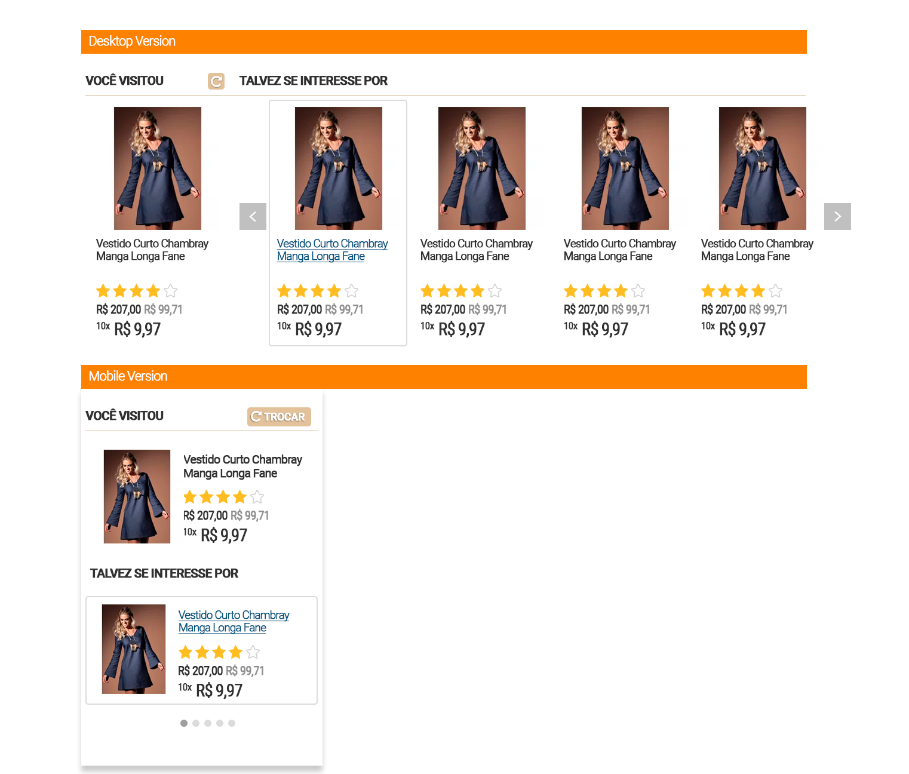

# Desafio Linx

Foram propostas 3 atividades que estão descritas mais detalhadamente no arquivo anexo [Instruções](https://github.com/matheusroversi/linx/blob/master/Instruc%CC%A7o%CC%83es.pdf)

- [ ] Encontre os erros
- [ ] Desenvolver layout
- [ ] Desenvolver HTML e CSS do layout

## Atividade 1 - Encontre os erros

No arquivo  Encontre os erros.png  há uma série de erros, tanto de css quanto de  renderização que precisam ser ajustados. Enumere e descreva os erros encontrados  nessa interface. 

[Resultado da Atividade 1](Atividade_1/resultado.pdf)


## Atividade 2 - Desenvolver layout

Desenvolver um layout para uma vitrine personalizadas que possui o wireframe anexado, basear-se na identidade visual e posicionamento dos elementos do cliente apresentado.



[Resultado da Atividade 2 - PSD](Atividade_2/resultado.psd)


## Atividade 3 - Desenvolver HTML e CSS do layout

Desenvolver o layout proposto na atividade anterior. Somente HTML e CSS.

[Preview Online](linx.netlify.com)

O HTML pode ser rodado baixando o repositório e rodando diretamente o index.html ou seguir o processo de instação.

## Instalação do projeto

```sh
$ git clone https://github.com/matheusroversi/linx.git seu_repositorio
```

```sh
$ npm install
```

```sh
Executar o index.html
```


> Versão Desktop


> Versão Mobile

Esta versão mobile foi testada diretamenta no smartphone e apresentou renderização com sucesso. Para qualquer projeto a simulação mobile diretamente no navegador desktop pode apresentar problemas de renderização, caso isso ocorra desative a ative novamente.

```sh
 `Ctrl + Shift + M`
```


## Sobre a realização do teste

> Teste 1: Estava muito bem claro os erros.

> Teste 2: Baseei nas informações propostas no wareframe apresentado respeitando a identidade visual da empresa, cores, espaçamento dos elementos. Sobre a fonte, o site da empresa possui algumas divergencias sobre  "padronização", algumas paginas possui uma fonte diferente de outras, considerei a que mais me agradou visualmente entre 'Roboto' e a 'Roboto Condensed'.

> Teste 3: Utilizei HTML, CSS e SASS que facilitou a organização das folhas de estilo.


## Autor

| |
|:---------------------:|
|  [Matheus Roversi](https://github.com/matheusroversi/)   |
